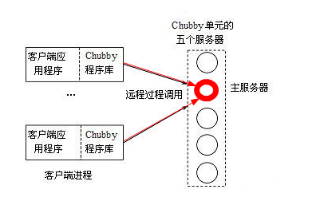
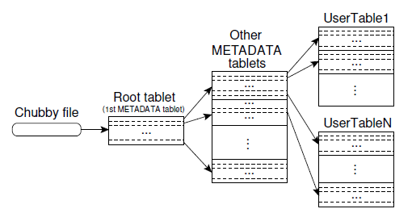

# Bigtable 论文 阅读笔记 - 原理部分
##

> Paper: [Google Bigtable paper](http://static.googleusercontent.com/external_content/untrusted_dlcp/research.google.com/zh-CN//archive/bigtable-osdi06.pdf)  
> Notes author: Lhfcws Wu  
> Time: 2013-07-24  
##
**Preface:**  
仅为个人阅读心得，按照原论文Section顺序写的笔记。  
原论文Sections: （本笔记主要关于粗体的章节，即原理部分）   
1 Introduction  
**2 数据模型（行，列族，时间戳）**  
**3 API支持简述**  
**4 Bigtable构建（文件格式SSTable，所依赖的一些框架服务）**  
**5 Bigtable的基础实现（Tablet定位，分配，服务和memtable压缩）**  
6 优化措施  
7 性能评估  
8 Google实际应用  
9 经验教训  
10 相关工作  

..........................................................  
Abstract 和 Sec1 简介就不赘述，没什么实际内容，需要的自己看原文。

##
### Data Model （数据模型）
**行键**： 任意小于64KB的字符串。  
Bigtable内部的行键会按照字典序排列，对于任何单个的行键操作都是原子性的。

**Tablet**: 有的翻译为片，是Bigtable分配和负载均衡的单元单位，动态管理。（此概念在原理部分尤为重要）

**列族**: 一定数量的列的集合，是访问控制的单元单位。  
一般同一列族内的列都是同种类型，一个table里的列族数量一般期望是尽量少，最多不超过几百个，但一个table里可以有很多的列。

**列键**: 一般从属于某个列族，命名语法如 *family:qualifier*。

**时间戳**: 一个64位整数，每一行不同的时间戳对应不同的行版本。时间戳一般由客户端自动生成，也可以由用户编程中指定数字。

**版本**: Bigtable引入了版本管理（semi），由于每一个时间点行操作是原子的，所以默认由时间戳代表该行的不同的版本。但我称Bigtable的版本管理是semi-version-control，因为实际上，由于性能和容量的原因决定了它不像svn或git那样会保存之前所有修改的状态。一般可以由用户选择要保留最近的n个版本。其余的会被Bigtable的GC机制回收掉。

### API
Bigtable支持多样的甚至较复杂的操作，支持单行事务，支持与Map-Reduce一同使用。

### Bigtable构建
Bigtable借助分布式GFS（Google FileSystem）来存储日志和数据。其内部存储文件格式为SSTable。

**SSTable**: 提供一个持久有序不可变的map<string, string>。每个SSTable会占一段连续的块序列（一般每个块大小为64KB，可配置修改），起始的块索引会存在SSTable的末端，块索引可用于直接定位SSTable在磁盘上的位置（因此块索引会在SSTable打开之前读入内存）。有时，SSTable可完全先映射到内存中，减少操作时的磁盘开销。  
**->** [SSTable - 分布式存储](http://wenku.baidu.com/view/320dbdb8960590c69ec37620)

**Chubby**:  
**->** [Chubby详细介绍](http://blog.csdn.net/historyasamirror/article/details/3870168) 

>（下面的笔记是结合原paper关于Chubby部分和上面链接博客的核心思想提炼）  
   

Chubby是一个高可靠用于分布式的锁服务，目的是为了解决分布式一致性问题。总体基本上分为了两部分：服务器一端，称为Chubby cell；客户端一端，每个Chubby的client都有一个Chubby library，这两部分通过RPC进行通信。 
 
Chubby cell是一个分布式的系统，一般包含了5台机器，整个文件系统是部署在这5台机器上的。cell中每台server一般称为replica（副本）。Chubby工作时会从这些replicas中选举出一个master，每个master具有一个master lease，在此期间不会再有选举。  
master负责和client的通信，接收client的读写请求；而其他replicas不和client通信，只和master通信。replicas（包括master）会维护同一个DB的拷贝。一旦master收到写请求，master会把改写请求转发给其他replicas，然后更新自己的DB copy，同时其他replicas收到请求也会更新自己所维护的DB copy。读操作自然只需要从master获取即可。这样一旦master宕机，其他replicas也能迅速地选举出新的master。   
对内五台服务器，Chubby使用Paxos算法来保证内部分布式一致性，对外的一致性保证就是它的lock service。（[Paxos算法](http://zh.wikipedia.org/wiki/Paxos%E7%AE%97%E6%B3%95)） 

client端通过Chubby library的接口调用，在Chubby cell上创建文件来获得相应的锁的功能。client会维护一个Chubby服务的session，session同样也会有session lease。client可以通过注册回调函数来通知Chubby cell发生了变化或过期事件。
  
Chubby的 lock service 实现实际上是一个分布式的文件系统，所谓的锁就是文件。Chubby会在一个特定的目录下进行锁文件的查找、创建和删除。  

### Bigtable的基础实现
Bigtable核心组件主要有三部分：  
1. 一个与每个客户端相连接的Library  
2. 一个master服务器（此master和Chubby cell master无关）  
3. 多个tablet服务器  

master服务器负责tablets的分配回收，管理tablet服务器的lease，tablet servers的负载均衡，GFS的文件垃圾回收以及处理表和列族增删导致的schema变化。  
每一个tablet服务器管理几十到上千的tablets，负责处理本服务器内的tablets的读写请求和tablets的合并分裂。客户端与tablet服务器的读写通信不需要经过master，也不依靠master进行tablet定位。  
一个Bigtable集群会拥有几百个以上的Tables，每个Table对应一个或多个Tablets。初始一个Table对应一个Tablet，当Table膨胀的时候，其对应的Tablet也会膨胀。当Tablet达到一定size大小的时候会分裂成多个tablets（一般默认每个100M~200M）。

#### Tablet Location
Tablet存储的三层B+树架构：  

第一层为Root Tablet（1st METADATA Tablet），拥有所有METADATA Tablets的locations。Root Tablet永不分裂，即METADATA Tablets的数目会有上限。  
第二层为METADATA Tablets，每个METADATA Tablet大约占1KB内存，定位一个UserTable，并记录tablet操作的log。  
第三层即为UserTable。  
> 原paper中有个例子： 假设META Tablet上限为128MB，那么他一共能映射的用户级的Tablets为(2 ** 17) * (2 ** 17) = 2 ** 34 个， 折算成字节则为 (2 ** 34) * 128MB = 2 ** 61 .

客户端会缓存它请求过的tablet locations。如果cache miss，客户端会按照三层架构去递归地查询所要的tablet location。

1. 如果客户端缓存为空，定位算法会耗时3个RTT。  
2. 如果客户端缓存过时，定位算法会耗时6个RTT。
3. Prefetch优化：当客户端请求到一个METADATA Table的时候，它会额外读取部分并非本次请求的metadata，以便不时之需。

#### Tablet Assignment
当tablet被某Tablet Server管理的时候，Chubby会生成一个相应的锁文件。  
Tablet Server会遇到以下几种情况：  
1. 锁文件不存在：Tablet自己kill掉自己  
2. 丢失Chubby Session或其他失去锁的情况： 停止伺服相应的tablet  

Tablet会遇到以下情况：  
1. 被Tablet Server伺服，此时为assigned状态
2. 被master Server管理，处于unassigned状态
3. 刚被Tablet Server丢失，还未被master回收。此时若master发现此tablet，会先询问其他Tablet Servers对此tablet的锁状态，否则将其回收至unassigned。

Master Server：
1. Tablet Server出问题，Master会尝试去获得其锁文件，一旦获得成功就会kill掉此台出问题的Tablet Server。
2. Chubby session过期，Master会kill掉自己。但并不会改变Tablet Servers的相应tablets的分配状态。

（以上主要是通过描述Tablet 的容错性来展现tablet assignment的一些细节，具体建议看原文 5.2 部分）

Master startup steps：  
1. Master获取Chubby中唯一的Master lock，以证明其Master身份。
2. Master扫描alive server。  
3. Master与每台alive server通信，以确定当前 tablet 的分配情况。  
4. Master扫描METADATA Table来获取全部的 tablets 目录，根据step 3的结果将每个tablet 分为 assigned 和 unassigned，unassigned的加入到一个 Unassigned Set 中。

Tablet只受Table的变化而变化（膨胀，分裂，合并等），Tablet Server直接管理tablet的变化，然后再通过修改METADATA（即commit步骤），将变化信息notify给Master。

#### Tablet Serving
Tablet的持久化是通过GFS的文件形式实现的。  
METADATA实际包括一堆SSTable（Tablet，a set of redo points）  

**Memtable**:内存中一段buffer，有序存储最近（具体多近看用户配置）提交的内容。 

写操作请求到达Tablet Server：  
1. 检查格式完备性和权限  
2. 将写操作写到commit log中。  
3. 提交的内容同时写到memtable中。

读操作请求到达Tablet Server：  
1. 检查格式完备性和权限  
2. 将SSTable和Memtable里的内容合并排序
3. 根据字典序直接查找定位，返回结果。

#### Compaction
**minor compaction**：如果写操作时，memtable大小达到一定阀值，则在内存中创建一个新的memtable，旧的memtable转化成SSTable写到GFS中。

**merging compaction**：读取部分SSTables和Memtable，将其合并生成新的SSTable，然后丢弃输入部分的SSTables和Memtable。此操作会周期性地在后台进行，目的是应对minor compaction过程持续地生成新的SSTable。

**major compaction**：如果执行merging compaction时是将所有的SSTables合并，则此过程称为major compaction。Bigtable也会定期执行major compaction，目的是为了清除minor compaction过程可能产生的一些已删除条目。